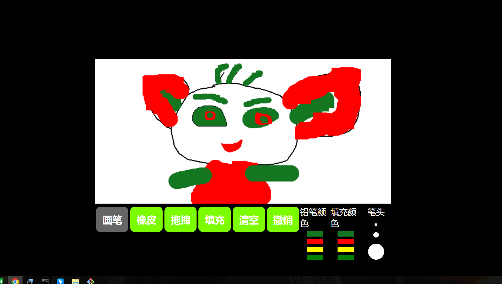

# 我的日常
记录我日常遇到的一些有意思的东西，或者我日常学习和练习的一些东西

## canvas
此demo主要用canvas实现了一个简易的画板工具。包括线条绘制，橡皮擦，颜色填充，清空画板，选择画笔颜色，选择填充颜色，选择笔头粗细等等功能
**2022/10/18 -- 新增拖拽和撤销功能**



## vue2响应式原理
此demo模拟实现了vue的数据劫持，双向绑定，数组对象原型方法代理。使用数据劫持结合发布订阅者模式。
为对象基本类型数类型追加get和set方法。为数组设置代理。重写了数组原型对象方法。并且在重写的方法里面调用了数组
本身的方法。不会影响数组原本的操作。
**2022/11/1 -- 新增简单{{}}模板编译及绑定，虚拟dom和真实dom转换**
#### html
```
		<div class="root">
			<div class="name">哈哈哈{{name}}</div>
			<div class="text">{{age}}</div>
			<button onclick="add()">姓名add</button>
			<button onclick="del()">年龄del</button>
		</div>
```

#### 实例化
```		
		const people = {
			name: 1,
			age: 12,
			parents: {
				dad: 'a',
				mom: 'b'
			},
			arr: ['d', 'e'],
			list: ['f', 'e']
		};
		new myVue(document.querySelector('.root'),people)

		function add() {
			people.name++
		}

		function del() {
			people.age--
		}
```

## 一些炫酷的动效
此demo主要展示一些简单的动画效果

## 原生js实现图片压缩功能
此demo主要实现选择图片，压缩后下载的功能。主要使用html5的canvas标签的toDataURL和drawImage方法。首先选择图片，创建img标签。
并将其固定定位在屏幕外，创建canvas标签，大小和定位在图片上。获取到图片实例。调用canvas的drawImage()将其绘制在canvas上。
再调用canvas的toDataURL('image/jpeg', 压缩比例)生成压缩后的图片的base64编码。后调用base64转文件的方法生成文件，动态创建a标签下载

